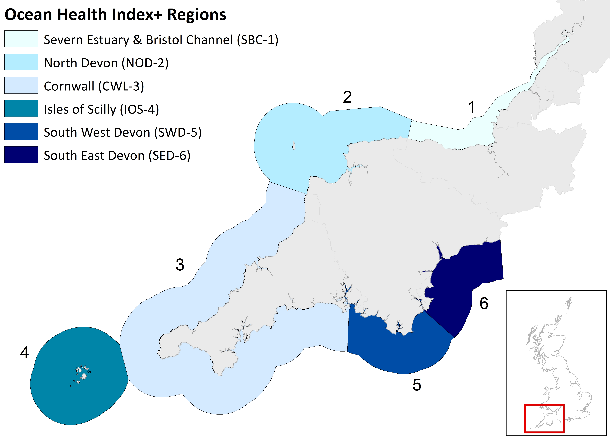

<!--- please edit as needed!--->

----

The OHI+ for South West England website has moved. For further details on the assessment visit our new project website at: [www.sustainable-seas.org](https://www.sustainable-seas.org/)
 
 
**Assessing Ocean Health at the Regional Scale**

The Ocean Health Index global framework can be used regionally to help provide a more geographically relevant understanding of the state of the marine environment. This has been done in Hawaii, the Baltic Sea, West Coast Pacific US to name but a few locations. When the OHI framework is applied at a regional level, it is known as OHI+, which enables modifications to the framework to better reflect regional differences.  

 **OHI+ for South West England**

An OHI+ assessment for South West England will provide an independent, repeatable and transparent overview of the health of our coastal seas. We will tailor the OHI+ framework to represent the cultural, social, and ecological characteristics and priorities of South West England using the best available information and knowledge. As the OHI+ framework is transparent and repeatable over time, it can be integrated into ongoing policy initiatives to support sustainable ocean management. We anticipate the results will be relevant to a variety of management groups or initiatives such as; Local Nature Partnerships, Environmental Growth Strategies, Blue Growth Agendas and Marne Spatial Planning efforts.

 

**Project Delivery**

The OHI+ South West project is being delivered by an interdisciplinary team of researchers from the University of Exeter, overseen by a steering group of partners from the fields of industry, conservation and governance. Based across the[Environment and Sustainability Institute](https://www.exeter.ac.uk/esi/) in Cornwall and at the [Streatham Campus](https://www.exeter.ac.uk/visit/campuses/streatham/), you can read our team profiles [here](https://www.sustainable-seas.org/team).

 
 **Future assessments**

The project will provide a baseline characterisation of marine health for South West England. Our OHI+ assessment can be updated annually or on other management time frames with less effort than its initial development. All analysis is done using open source collaborative software (R, RStudio, Git, GitHub) and as such the framework can be updated with the most recent data. There is also the potential for this OHI+ assessment to expand to other English regions.

