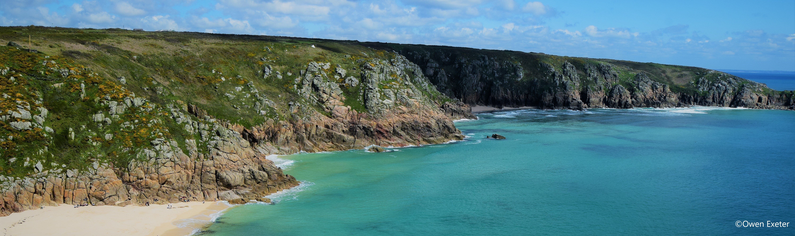
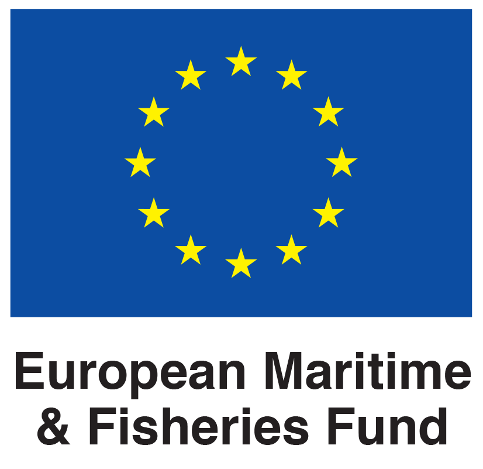

---

 

The OHI+ for South West England website has moved. For further details on the assessment visit our new project website at: [www.sustainable-seas.org](https://www.sustainable-seas.org/)
  

<i class="fa fa-globe fa-x"></i>  **The Ocean Health Index (OHI)**</h2> 
The OHI is a tool to measure the benefits and services that the ocean provides for people now and into the future. Assessments are developed with the support of local stakeholders to better understand how to sustainably balance current and future ocean use. Discover more at [sustainable-seas.org](https://www.sustainable-seas.org/). 

<i class="fa fa-folder-open fa-x"></i>  **The project**</h2> 
The application of OHI to the South West (known as OHI+) aims to provide a regional baseline for marine health. The project coincides with development of the Marine Management Organisation’s South West Marine Plan and as such we assess the relevance that a regional OHI+ assessment may have to regional planning strategy. The inclusion of multiple diverse data sets across key goals enables engagement with a broad range of marine stakeholder groups. All data and methods are open source, ensuring the process is transparent and repeatable.

<i class="fa fa-user fa-x"></i>  **The team**</h2>
The South West Ocean Health Index is being conducted by [researchers](https://www.sustainable-seas.org/team) from the University of Exeter. The project began in 2018 and results are expected to be made available Autumn 2020.

----

