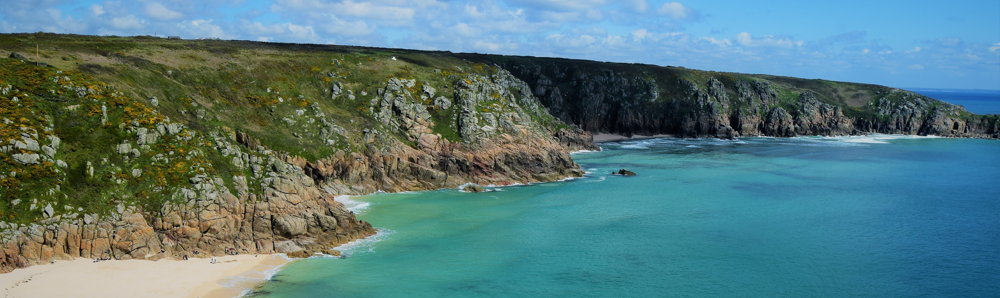

---

<i class="fa fa-globe fa-x"></i>  **The Ocean Health Index**</h2> 
The Ocean Health Index (OHI) is a tool to measure the benefits and services that the ocean provides for people now and into the future. Assessments are developed with the support of local stakeholders to better understand how to sustainably balance current and future ocean use. Discover more at [oceanhealthindex.org](www.oceanhealthindex.org). 

<i class="fa fa-folder-open fa-x"></i>  **The project**</h2> 
The application of the OHI framework to the South West coincides with development of the Marine Management Organisation's [South West Marine Plan](https://www.gov.uk/government/collections/south-west-marine-plan). The project aims to provide a metric to assess the impact of this and other management measures for the region.

<i class="fa fa-tag fa-x"></i>  **The team**</h2>
The South West Ocean Health Index is being conducted by [researchers](http://ohi-science.org/esw/who_we_are.html) from the University of Exeter. The project began in 2018 and results are expected to be made available early 2020.

A sign up link for project updates will shortly be available here.

----

 

