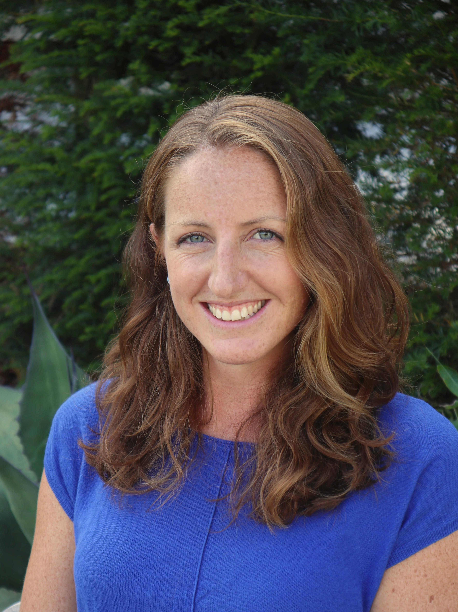
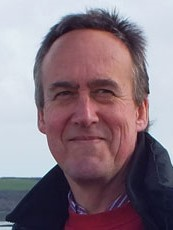

<!--- please update--->

----
 

The OHI+ for South West England website has moved. For further details on the assessment visit our new project website at: [www.sustainable-seas.org](https://www.sustainable-seas.org/)
  
 

[**Dr Matthew Witt**](https://biosciences.exeter.ac.uk/staff/index.php?web_id=matthew_witt) (project lead and spatial ecologist) - _M.J.Witt@exeter.ac.uk_

Matthew is an Associate Professor in Natural Environment. He has 15 years’ experience in marine vertebrate ecology and conservation, spatial ecology, ecological modelling and satellite remote sensing. His research group works on issues of human-wildlife spatio-temporal conflict and marine sustainability with a strong focus on “big data” in the marine environment.

 
 
 

[**Dr Rachel Turner**](http://geography.exeter.ac.uk/staff/index.php?web_id=Rachel_Turner) (project lead and social scientist) - _R.Turner@exeter.ac.uk_

Rachel is a Senior Lecturer in Environmental Social Science focusing on coupled human-natural systems and their governance, in particular relating to fisheries and marine conservation. Her research explores issues such as how resource users respond to change, what drives spatial behaviour at sea, and how governance practices influence the social wellbeing of coastal communities. Rachel will co-manage the project and lead on all social science aspects of the project. 

 
 
 

**Dr Stephen Pikesley** (post-doctoral research associate) - _S.K.Pikesley@exeter.ac.uk_

Stephen is a marine spatial ecologist with expertise in dataset integration and statistical modelling. His research experience integrates the use of spatial ecological tools, including satellite tracking, aerial surveys, remote sensing, GIS and habitat modelling to help identify and gain insight, into marine vertebrate spatial and temporal distribution patterns and trends and, where possible, to ascertain potential areas of threat.

 
 
 
 

**Owen Exeter** (project officer) – _O.Exeter@exeter.ac.uk_

Owen has an interdisciplinary research background with experience in GIS, decision support software and stakeholder engagement. His previous research focused on combining socioeconomic and ecological data   to inform marine spatial planning in data poor regions. Owen will be responsible for sourcing and processing data, eliciting stakeholder input and ensuring iterative developments of OHI+ indicators are tailored to the South West region.

 
 
 

**Christopher Kerry**  (project officer) - _C.Kerry@exeter.ac.uk_

Chris is an experienced GIS specialist, he routinely works with geospatial data, dataset processing and the challenges of transposing data from aspatial to spatial formats. He is interested in utilising emerging technologies to study the spatial ecology of marine vertebrates and as a tool for fisheries management.   Chris left the project in 2019 to pursue a PhD position at the University of Exeter but remains involved in the project.

 
 
 
**Project Steering Group**

The project is advised by a group of regionally relevant organisations that are either data custodians or have mandates likely to facilitate the successful delivery of the project. Representatives have been identified from the following Government departments and Non-Government groups:

Cornwall Council - https://www.cornwall.gov.uk/   
Cornwall Wildlife Trust - https://www.cornwallwildlifetrust.org.uk/   
Devon Wildlife Trust - https://www.devonwildlifetrust.org/    
Isles of Scilly Inshore Fisheries and Conservation Authority - https://www.scillyifca.gov.uk/   
Marine Management Organisation - https://www.gov.uk/government/organisations/marine-management-organisation   
Natural England - https://www.gov.uk/government/organisations/natural-england   
South West Marine Ecosystems - https://swmecosystems.co.uk/ 

 

